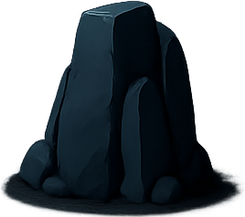
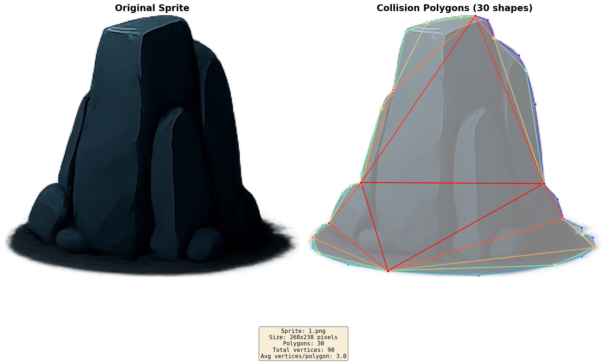

# 🎮 Sprite Collision Polygon Generator

Automatically generate collision polygons from sprite images using ear clipping triangulation (Godot-compatible).

[](https://www.python.org/downloads/)
[](https://opensource.org/licenses/MIT)

## ✨ Features

- 🔺 **Ear Clipping Triangulation** - Same algorithm used by Godot Engine
- 🎯 **Boundary Preservation** - Triangles stay within sprite boundaries
- 🚀 **Batch Processing** - Process multiple sprites at once
- 📊 **Visual Preview** - Generate overlay images for verification
- 🎮 **Game Engine Ready** - JSON output compatible with Godot, Unity, etc.

## 🚀 Quick Start

### Installation

```bash
# Clone the repository
git clone <your-repo-url>
cd py_auto_cillision_2d

# Install dependencies
pip install -r requirements.txt
```

### Usage

```bash
# Process a single sprite
python -m src.cli input/sprite.png

# Process all sprites in a folder
python -m src.cli input/

# Adjust simplification (smaller = more detail)
python -m src.cli input/sprite.png --epsilon 2.5
```

## 📖 Examples

### Input → Output

**Input Sprite** (`input/1.png`):



Star-shaped sprite (268×238 pixels)

**Output JSON** (`output/json/1.json`):

```json
[
  [[139.0, 1.0], [163.0, 5.0], [169.0, 21.0]],
  [[169.0, 21.0], [191.0, 37.0], [198.0, 50.0]],
  [[198.0, 50.0], [206.0, 81.0], [214.0, 153.0]],
  ...
]
```

**Result**: 23 triangles generated with perfect boundary alignment

**Visual Preview** (`output/preview/1.png`):



*Green outlines show generated collision triangles*

See [`assets/examples/1.json`](assets/examples/1.json) for complete output.

## 📋 Output Format

Pure JSON array of triangles:

```json
[
  [[x1, y1], [x2, y2], [x3, y3]],  // Triangle 1
  [[x1, y1], [x2, y2], [x3, y3]],  // Triangle 2
  ...
]
```

- **Coordinates**: Pixel-based from top-left (0,0)
- **Format**: `[x, y]` pairs with float precision
- **Triangulation**: Ear clipping algorithm (no triangle overflow)
- **No metadata**: Pure coordinate data only

## ⚙️ Configuration

| Parameter | Default | Description |
|-----------|---------|-------------|
| `--alpha-threshold` | 128 | Alpha channel threshold (0-255) |
| `--epsilon` | 2.0 | Simplification tolerance (lower = more detail) |
| `--output-json` | `output/json/` | JSON output directory |
| `--output-preview` | `output/preview/` | Preview image directory |

## 🏗️ How It Works

1. **Load PNG** - Extract alpha channel for transparency
2. **Detect Contours** - Find sprite boundaries using OpenCV
3. **Simplify** - Reduce vertices using Douglas-Peucker algorithm
4. **Triangulate** - Apply ear clipping (Godot's method)
5. **Export** - Generate JSON + visual preview

## 🔧 Requirements

- Python 3.9+
- OpenCV (image processing)
- NumPy (array operations)
- earcut (triangulation)
- matplotlib (preview generation)

See [`requirements.txt`](requirements.txt) for complete list.

## 🎯 Use Cases

- Game development (2D collision detection)
- Physics engine integration
- Sprite optimization for web/mobile
- Automated asset pipeline

## 🤝 Contributing

Contributions welcome! Please feel free to submit a Pull Request.

## 📄 License

MIT License - see [LICENSE](LICENSE) file for details.

## 🙏 Acknowledgments

- Ear clipping algorithm based on [mapbox/earcut](https://github.com/mapbox/earcut)
- Compatible with [Godot Engine](https://godotengine.org/)'s triangulation

---

**Made with ❤️ for game developers**
